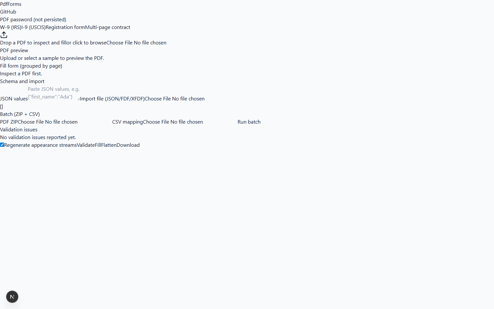

# PdfForms (`acroform-filler`)

PdfForms is an AGPL-licensed PDF AcroForm tool to inspect fields, fill from JSON/FDF/XFDF/CSV, regenerate appearance streams, flatten forms, validate field values, and run batch ZIP workflows.



## Features

- Field inspection (`/v1/inspect`) with name, type, options, required, max length, value, page, and bbox.
- Auto-generated form UI in the Next.js playground.
- JSON/FDF/XFDF import and schema-driven validation.
- Fill with appearance regeneration toggle and flatten option.
- Batch ZIP + CSV mapping fill flow (`/v1/batch`).
- Signed artifact download URLs with TTL.

## Stack

- Web: Next.js 15 + Tailwind 4 + shared workspace packages.
- Worker: Python 3.12 + FastAPI + `pypdf` + `pdfcpu` + `qpdf`.

## Local development

1. Install Node 22+, pnpm 10+, Python 3.12+.
2. Install JS deps:

```bash
pnpm install
```

3. Install worker deps:

```bash
cd apps/worker
python -m pip install -e .[dev]
```

4. Start worker:

```bash
cd apps/worker
python -m uvicorn app.main:app --host 127.0.0.1 --port 8000
```

5. Start web:

```bash
pnpm --filter @pdf-forms/web dev --port 3000
```

6. Open `http://127.0.0.1:3000`.

## Docker compose

```bash
docker compose up --build
```

Web: `http://localhost:3000`  
Worker: `http://localhost:8000/healthz`

## Self-host verification

```bash
python apps/worker/scripts/verify_hosted.py \
  --web-url https://pdf-forms.your-domain.tld \
  --api-url https://api.pdf-forms.your-domain.tld/healthz
```

The command fails non-zero unless both hosted endpoints return 2xx and both TLS certificates validate.
You can also set `PDF_FORMS_WEB_URL` and `PDF_FORMS_API_URL` env vars and run `python apps/worker/scripts/verify_hosted.py`.

Section 14 release-gate runbook: `docs/SECTION14_RUNBOOK.md`.
Release artifact verification helper: `python apps/worker/scripts/verify_release_artifacts.py --repo <owner>/acroform-filler --tag <vX.Y.Z>`.
A1 evidence helper: `python apps/worker/scripts/generate_a1_evidence.py`.

## Quality notes

- Password inputs are request-scoped and not persisted.
- Job artifacts are ephemeral and purged by TTL.
- API errors use explicit codes (e.g. `401_PDF_PASSWORD_REQUIRED`, `409_XFA_NOT_CONVERTIBLE`).
